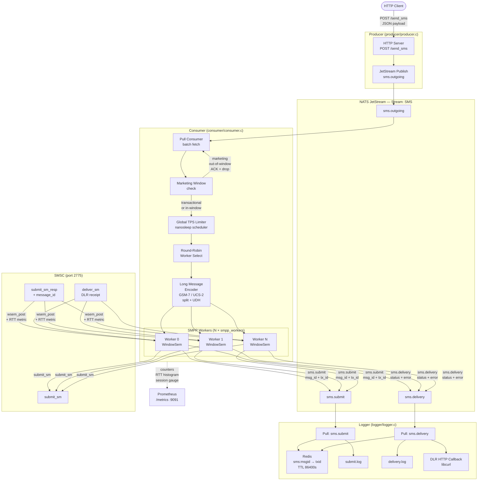
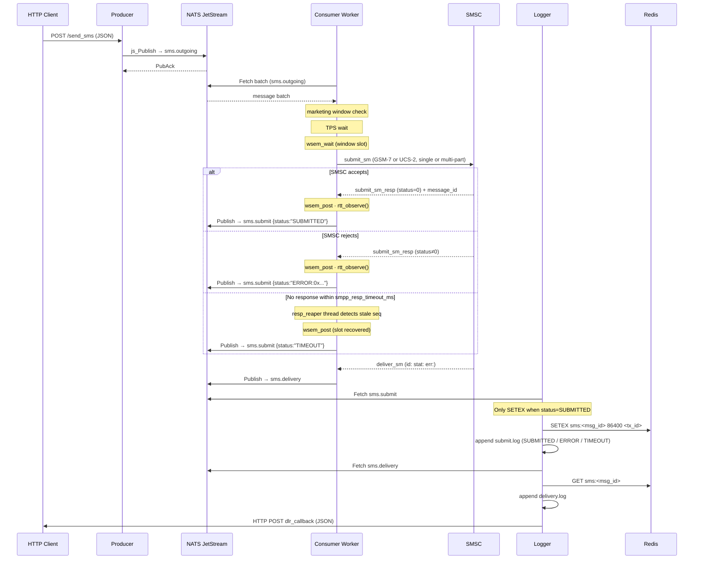
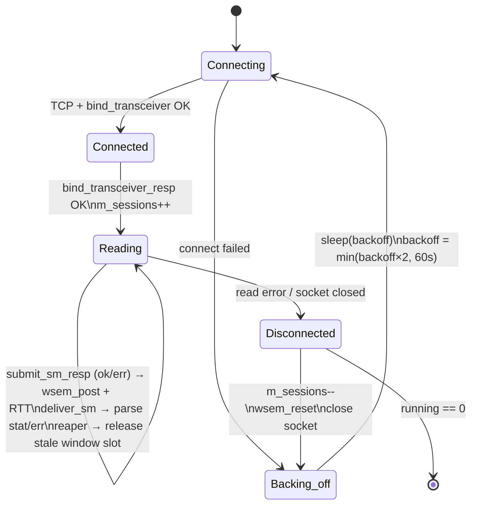

# C SMPP Messaging Gateway

A carrier-grade **SMS gateway written in C** built around an event-driven pipeline:
**HTTP → NATS JetStream → SMPP → Redis → Logging → DLR Callback**

---

## Architecture



---

## Message Flow Detail



---

## Worker Lifecycle



---

## Components

### Producer — `producer/producer.c`

- Starts an HTTP server on `producer_port`
- Accepts `POST /send_sms` with a JSON body
- Ensures the JetStream stream `SMS` exists (subjects: `sms.outgoing`, `sms.submit`, `sms.delivery`)
- Publishes the raw payload to `sms.outgoing`

**Request**

```json
{
  "transaction_id": "TX123",
  "sender":         "MYAPP",
  "destination":    "447700900000",
  "message":        "Hello world",
  "message_type":   "transactional"
}
```

> `message_type` is optional. Values: `transactional` (default, always sent) or `marketing` (dropped outside the send window).

**Response:** `queued`

---

### Consumer — `consumer/consumer.c`

Pull-based JetStream consumer that owns all SMPP state.

| Feature | Detail |
|---|---|
| **SMPP workers** | `smpp_workers` parallel bind_transceiver sessions |
| **Window control** | Per-worker `WindowSem` caps in-flight PDUs at `smpp_window_size` |
| **TPS limiter** | Global microsecond scheduler across all workers |
| **Encoding** | Auto-detects ASCII → GSM-7 or non-ASCII → UCS-2 |
| **Long messages** | Auto-splits with 6-byte UDH; up to 16 segments |
| **Reconnect** | Exponential backoff: 1 s → 2 → 4 → … → 60 s |
| **DLR parsing** | Extracts `id:`, `stat:`, and `err:` from receipt text |
| **Marketing window** | Drops `marketing` messages outside `send_window_morning`–`send_window_evening` |
| **Metrics** | Prometheus text endpoint on `metrics_port` |
| **Resp timeout reaper** | Background thread recovers window slots for unacknowledged PDUs after `smpp_resp_timeout_ms`; publishes TIMEOUT event to submit log |
| **SMSC error detection** | Non-zero `submit_sm_resp` status logged as `ERROR:0x...` in submit.log; only `SUBMITTED` counted as success in metrics |
| **Configurable retry** | `smpp_retry_on_fail=1` NAKs the NATS message on write failure (requeues for retry); `0` ACKs and drops |
| **Shutdown** | `SIGINT`/`SIGTERM` drains workers cleanly via `pthread_join` |

**Prometheus metrics exposed**

| Metric | Type | Description |
|---|---|---|
| `sms_submitted_total{status="success\|failed"}` | counter | submit_sm PDUs sent |
| `sms_dlr_received_total` | counter | deliver_sm receipts received |
| `smpp_sessions_connected` | gauge | active bind_transceiver sessions |
| `sms_submit_rtt_ms` | histogram | submit_sm round-trip time (ms) |

---

### Logger — `logger/logger.c`

Pull-based JetStream consumer on `sms.submit` and `sms.delivery`.

| Action | Detail |
|---|---|
| `sms.submit` | Writes `submit.log`, stores `sms:<msg_id> → tx_id` in Redis (TTL 86400 s) |
| `sms.delivery` | Looks up `tx_id` from Redis, writes `delivery.log`, fires DLR callback |
| Redis reconnect | Auto-reconnects on connection drop |

---

## Log Formats

**submit.log** — one row per `submit_sm_resp` (or timeout)

| Field | Description |
|---|---|
| timestamp | UTC ISO-8601 |
| message_id | SMSC-assigned ID (empty on ERROR/TIMEOUT) |
| transaction_id | caller's TX ID |
| status | `SUBMITTED`, `ERROR:0x<hex>`, or `TIMEOUT` |
| message | original message text |

```
2026-04-11T10:00:01Z|msg123|TX456|SUBMITTED|Hello world
2026-04-11T10:00:02Z||TX789|ERROR:0x00000045|Bad destination
2026-04-11T10:00:07Z||TX999|TIMEOUT|Unresponsive SMSC
```

**delivery.log**
```
2026-04-11T10:00:03Z|msg123|TX456|DELIVRD
```

---

## DLR Callback

POST to `dlr_callback` URL on delivery:

```json
{
  "transaction_id": "TX456",
  "message_id":     "msg123",
  "status":         "DELIVRD"
}
```

---

## Configuration — `config/gateway.conf`

```ini
# Producer HTTP
producer_port=8080
producer_route=/send_sms

# NATS JetStream
nats_url=nats://127.0.0.1:4222
nats_stream_name=SMS
nats_subject_outgoing=sms.outgoing
nats_subject_submit=sms.submit
nats_subject_delivery=sms.delivery
nats_consumer_smpp=smpp_consumer

# Redis
redis_host=127.0.0.1
redis_port=6379

# SMPP
smpp_host=127.0.0.1
smpp_port=2775
smpp_system_id=test
smpp_password=test
smpp_system_type=SMPP

# Worker pool
smpp_workers=4          # parallel bind_transceiver sessions
smpp_window_size=20     # max in-flight submit_sm per worker

# Throughput
tps=100                 # global submissions per second (0 = unlimited)

# DLR
dlr_callback=http://localhost:9000/dlr

# Logging
log_dir=logs

# Marketing send window — messages with message_type=marketing are
# dropped outside this range. Use 00:00 / 23:59 to disable.
send_window_morning=08:00
send_window_evening=21:00

# Prometheus metrics
metrics_port=9091

# submit_sm_resp timeout: release window slot if no response within N ms.
# 0 disables the timeout.
smpp_resp_timeout_ms=5000

# 1 = NAK the NATS message on socket write failure so it requeues for retry.
# 0 = ACK and drop.
smpp_retry_on_fail=1
```

---

## Directory Structure

```
smpp_client_c/
├── producer/
│   └── producer.c          HTTP server → JetStream publish
├── consumer/
│   └── consumer.c          JetStream pull → SMPP workers
├── logger/
│   └── logger.c            JetStream pull → Redis + logs + DLR
├── common/
│   ├── config.c / config.h shared config loader
│   ├── events.h            shared event struct definitions
│   ├── nats_bus.c          NATS publish helper
│   └── redis_store.c       Redis helper
├── config/
│   └── gateway.conf
└── logs/
    ├── submit.log
    └── delivery.log
```

---

## Dependencies

| Library | Used by | Purpose |
|---|---|---|
| `libnats` | all | NATS JetStream client |
| `libmicrohttpd` | producer | HTTP server |
| `hiredis` | logger | Redis client |
| `libcurl` | logger | DLR HTTP callback |
| `pthread` | consumer | worker threads |

**Ubuntu install**

```bash
sudo apt install \
  libmicrohttpd-dev \
  libhiredis-dev \
  libcurl4-openssl-dev \
  libnats-dev
```

---

## Build

```bash
# Producer
gcc producer/producer.c common/config.c \
    -lmicrohttpd -lnats \
    -o producer-server

# Consumer
gcc consumer/consumer.c common/config.c common/nats_bus.c \
    -lnats -lpthread \
    -o consumer-server

# Logger
gcc logger/logger.c common/config.c \
    -lcurl -lhiredis -lnats \
    -o logger-server
```

---

## Run Order

```bash
# 1. Infrastructure
nats-server -js
redis-server

# 2. Gateway services (any order after infra is up)
./producer-server
./consumer-server
./logger-server
```

---

## Send a Message

```bash
curl -s -X POST http://localhost:8080/send_sms \
  -H "Content-Type: application/json" \
  -d '{
    "transaction_id": "TX001",
    "sender":         "MYAPP",
    "destination":    "447700900000",
    "message":        "Hello from the C gateway!",
    "message_type":   "transactional"
  }'
```

**Long message (auto-split):**

```bash
curl -s -X POST http://localhost:8080/send_sms \
  -H "Content-Type: application/json" \
  -d '{
    "transaction_id": "TX002",
    "sender":         "MYAPP",
    "destination":    "447700900000",
    "message":        "This message is longer than 160 characters so it will be automatically split into multiple SMS segments by the consumer, each carrying a User Data Header so the handset reassembles them in order.",
    "message_type":   "transactional"
  }'
```

**Unicode message:**

```bash
curl -s -X POST http://localhost:8080/send_sms \
  -H "Content-Type: application/json" \
  -d '{
    "transaction_id": "TX003",
    "sender":         "MYAPP",
    "destination":    "447700900000",
    "message":        "مرحبا بالعالم",
    "message_type":   "transactional"
  }'
```

---

## Metrics

```bash
curl http://localhost:9091/metrics
```

```
sms_submitted_total{status="success"} 1024
sms_submitted_total{status="failed"} 2
sms_dlr_received_total 998
smpp_sessions_connected 4
sms_submit_rtt_ms_bucket{le="50"} 810
sms_submit_rtt_ms_bucket{le="100"} 1020
sms_submit_rtt_ms_bucket{le="+Inf"} 1024
sms_submit_rtt_ms_sum 74210
sms_submit_rtt_ms_count 1024
```

---

## Feature Status

| Feature | Status | Notes |
|---|---|---|
| HTTP SMS API | ✅ | `POST /send_sms` |
| JetStream stream auto-create | ✅ | Producer ensures stream on startup |
| Pull-based consumer | ✅ | Batch fetch, JetStream ACK per message |
| Multiple SMPP sessions | ✅ | `smpp_workers` parallel bind_transceiver |
| SMPP window enforcement | ✅ | Per-worker `WindowSem`, blocks at `smpp_window_size` |
| Global TPS limiter | ✅ | Microsecond-precision nanosleep scheduler |
| GSM-7 single SMS | ✅ | ASCII ≤ 160 chars, `data_coding=0x00` |
| UCS-2 single SMS | ✅ | Non-ASCII ≤ 70 chars, `data_coding=0x08` |
| Long message (GSM-7) | ✅ | Auto-split at 153 chars/segment + UDH |
| Long message (UCS-2) | ✅ | Auto-split at 67 chars/segment + UDH |
| SMPP reconnect + backoff | ✅ | Exponential: 1s → 2s → … → 60s |
| DLR parsing (`stat:` + `err:`) | ✅ | Full receipt field extraction |
| Redis message mapping | ✅ | `sms:<msg_id>` → `tx_id`, TTL 86400s |
| Redis reconnect | ✅ | Auto-reconnects on connection drop |
| Structured logging | ✅ | `submit.log`, `delivery.log` |
| DLR HTTP callback | ✅ | libcurl POST with JSON payload |
| Marketing send window | ✅ | `send_window_morning` / `send_window_evening` |
| Prometheus metrics | ✅ | Counters + RTT histogram on `metrics_port` |
| submit_sm_resp timeout reaper | ✅ | `smpp_resp_timeout_ms`; background thread recovers stale window slots; logs TIMEOUT |
| SMSC error status detection | ✅ | Non-zero resp status → `ERROR:0x...` in submit.log; not counted as success |
| Configurable NAK on write fail | ✅ | `smpp_retry_on_fail=1` requeues; `0` drops |
| Clean shutdown | ✅ | `SIGINT`/`SIGTERM` drains workers, joins threads |
| SMPP enquire_link keepalive | ⚠️ | Not implemented — connections rely on OS TCP keepalive |
| Submit retry queue | ⚠️ | Write failures requeue via NAK (`smpp_retry_on_fail=1`); no dead-letter queue |
| Horizontal consumer scaling | ⚠️ | Single process; scale via JetStream queue groups |
